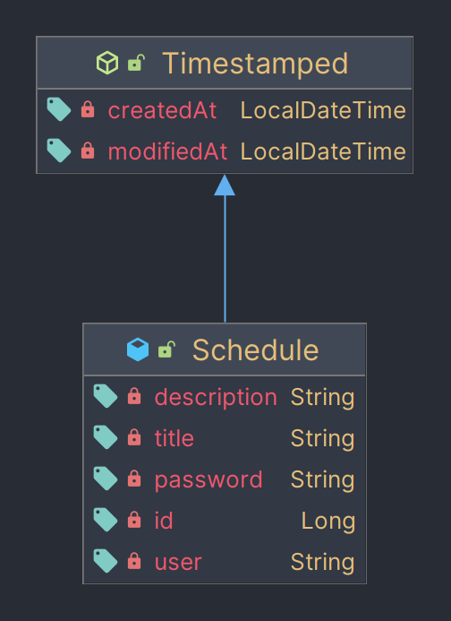
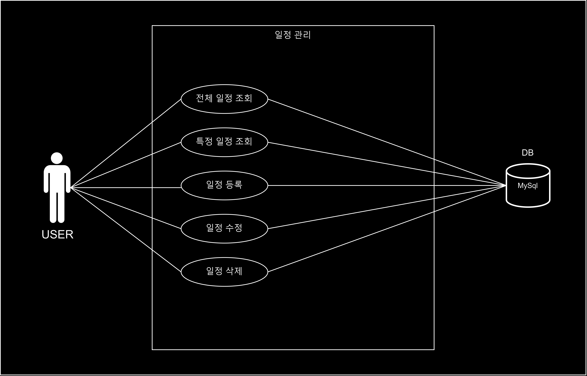

# 일정 관리

## 기능

+ 전체 일정 조회 기능
+ 특정 일정 조회 기능
+ 일정 등록 기능
+ 일정 수정 기능
    + 비밀번호 필요
+ 일정 삭제 기능
    + 비밀번호 필요

## API 명세서

| Name     | Method | URL                           | Request Param                      | Request Body                                                                                         | Response                                                                                              |
|----------|:------:|-------------------------------|------------------------------------|------------------------------------------------------------------------------------------------------|-------------------------------------------------------------------------------------------------------|
| 전체 일정 조회 |  GET   | /api/schedule                 |                                    |                                                                                                      | {{"id": "id",  "title": "title",  "description": "description",  "user": "user"},  {...}} |
| 특정 일정 조회 |  GET   | /api/schedule/{id}            | id: {id}                           |                                                                                                      | {"id": "id",  "title": "title",  "description": "description",  "user": "user"}              |
| 일정 등록    |  POST  | /api/schedule                 |                                    | {"title": "title",  "description": "description",  "user": "user",  "password": "password"} | {"id": "id",  "title": "title",  "description": "description",  "user": "user"}              |
| 일정 수정    |  PUT   | /api/schedule/{id}            | id: {id}                           | {"title": "title",  "description": "description",  "user": "user",  "password": "password"} | {"id": "id",  "title": "title",  "description": "description",  "user": "user"}              |
| 일정 삭제    | DELETE | /api/schedule/{id}/{password} | id: {id},  password: {password} |                                                                                                      | {id: {id}}                                                                                            |

## ERD

## Use Case Diagram

